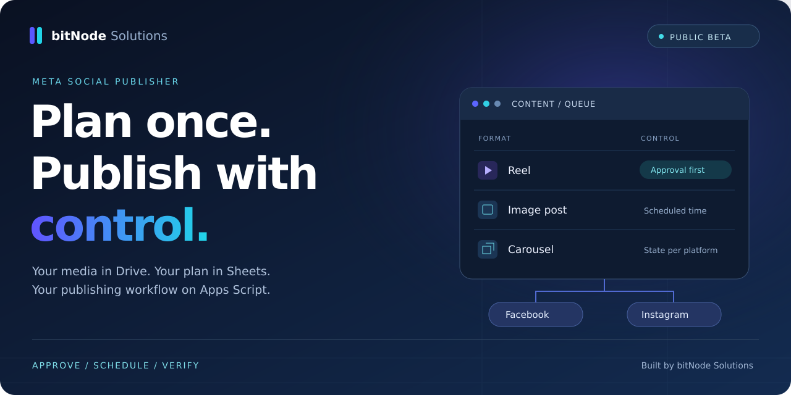
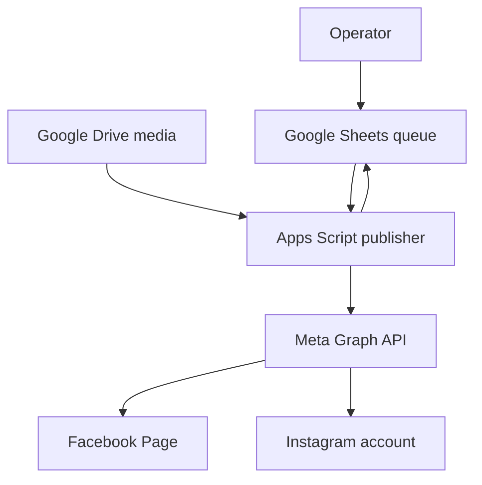

# Meta Social Publisher Automation

> Approval-gated Facebook and Instagram publishing from Google Sheets and Drive, powered by Apps Script and the Meta Graph API.



[](https://developers.google.com/apps-script)
[](https://developers.facebook.com/docs/graph-api/)
[](package.json)
[](LICENSE)

Schedule single-image posts, carousels, and reels from a Google Sheet while keeping source media in Google Drive. Facebook and Instagram advance independently, each remote mutation is recorded before it is sent, and nothing begins unless a row is explicitly `APPROVED`.

Apps Script runs in Google's cloud. Once the installable trigger is enabled, the operator can close the browser and turn off the computer.

> [!IMPORTANT]
> This is an independent open-source project, not an official Meta or Google product. API versions, permissions, media requirements, quotas, and review rules change. Confirm current platform documentation and test one private campaign row before approving a batch.

## What is included

| Capability | Included |
| --- | --- |
| Facebook Page publishing | Single images, multi-image posts, and reels |
| Instagram publishing | Single images, carousels, and reels |
| Editorial control | Exact `APPROVED` gate and read-only preview |
| Scheduling | Google Apps Script time-driven trigger |
| Media storage | Safe relative paths inside one Drive root |
| Recovery | Independent Facebook and Instagram state |
| Duplicate resistance | Intent-before-request state and remote verification |
| Date safety | Variable-event-date block until reconfirmed |
| Operations | Runtime budget, execution lock, and action cap |
| Setup | In-sheet connection dialog; no web-app deployment |

## Architecture



- The Sheet is the editorial queue and durable state store.
- Drive contains the original media. Only files for due rows are resolved.
- A time-driven trigger checks the queue approximately every five minutes.
- Facebook and Instagram progress independently, so one can recover without republishing the other.
- Platform state and confirmed remote IDs are written back to the row.

Read [the architecture notes](docs/architecture.md) for action sequences and recovery boundaries.

## Safety model

A new remote action is eligible only when:

- `approval` is exactly `APPROVED`
- `publish_at` is valid in the configured timezone
- media paths exist under the configured Drive root
- the media count and file types match the declared format
- the platform has not already reached a terminal state
- variable event dates have been reconfirmed
- the run remains inside operation and runtime limits

Approval authorizes publishing; it does not guarantee an exact delivery minute. Apps Script time-driven triggers may run several minutes after the scheduled time.

The publisher is duplicate-resistant, not mathematically exactly-once. A remote request can succeed immediately before a network timeout. When that happens, the code verifies the known remote object or stops for human review instead of blindly repeating the mutation.

## Supported formats

| Queue format | Media field | Notes |
| --- | --- | --- |
| `Single image` | One relative `.jpg` or `.jpeg` path | Published to both platforms |
| `Carousel` | 2–10 JPEG paths separated by `\|` | Order is preserved |
| `Reel` | One relative `.mp4` path | Direct full-file upload, 20 MiB default ceiling |

`reel_cover_filename` is optional. The current code can stage a JPEG and submit it as an Instagram `cover_url`; Meta behavior is API-version dependent, so test this on the connected account before batch approval. Facebook custom Reel covers are not implemented in this release. If no Instagram cover is supplied, the publisher uses a thumbnail offset.

Media constraints are controlled by Meta and can change. Verify current size, duration, codec, aspect-ratio, and carousel limits in the official documentation.

## Quick start

1. Import [`templates/publishing-queue.csv`](templates/publishing-queue.csv) into a new Google Sheet. Name the tab `Publishing Queue`.
2. In the spreadsheet, set the timezone you intend to use. The setup dialog also stores an explicit IANA timezone such as `Asia/Karachi`.
3. Format column D (`publish_at`) as plain text before pasting schedules.
4. Upload your media under one Google Drive campaign folder, following the relative paths in the queue.
5. Open **Extensions → Apps Script** from the spreadsheet.
6. Add every file from [`appsscript/`](appsscript/). Enable the manifest editor and replace `appsscript.json` with the repository version.
7. Save the project and reload the spreadsheet. A **Meta Publisher** menu appears.
8. Run **Install queue dropdowns and formatting** once.
9. Open **Setup and connect**. Enter the Drive folder, exact Facebook Page name, Page access token, and timezone.
10. Keep every row `DRAFT`. Approve one test row scheduled at least 10–15 minutes ahead.
11. Run **Validate approved rows**, then **Preview next action**.
12. Enable automatic posting and confirm the test on both public profiles before approving more rows.
13. Before using a format in a campaign, live-test that format once on both platforms; carousel, Reel, and custom-cover behavior can vary with Meta API changes.

No Apps Script web-app deployment is required or recommended for this bound-sheet installation.

See the complete [setup guide](docs/setup-guide.md).

When the local package is ready, follow [Publish this project to GitHub](docs/github-publish.md) for browser and command-line instructions.

## Queue contract

The publisher expects the exact A:Q header order below.

| Column | Field | Managed by |
| --- | --- | --- |
| A | `post_id` | Editor; immutable and unique |
| B | `media_files` | Editor; Drive-relative paths |
| C | `caption` | Editor; plain text |
| D | `publish_at` | Editor; `YYYY-MM-DD HH:mm` |
| E | `approval` | Editor; `DRAFT` or `APPROVED` |
| F:G | platform statuses | Publisher |
| H:I | platform state JSON | Publisher |
| J | `last_error` | Publisher |
| K | `format` | Editor |
| L | `reel_cover_filename` | Editor; optional |
| M:N | confirmed remote IDs | Publisher |
| O | `verification` | Editor; date-safety status |
| P:Q | `topic`, `notes` | Editor; internal metadata |

Read [the full queue schema](docs/queue-schema.md) before editing machine-owned columns.

## Repository structure

```text
meta-social-publisher-automation/
├── appsscript/               # Bound Google Apps Script project
├── assets/                   # Sanitized public visuals
├── docs/                     # Setup, schema, runbook, and case study
├── templates/                # Inert DRAFT queue and media layout
├── tests/                    # No-dependency Node tests for pure logic
├── SECURITY.md
├── CONTRIBUTING.md
└── README.md
```

## Testing

The queue parser, timestamp validation, approval gate, variable-date guard, state parser, and sample-data safety checks run without external services:

```bash
npm test
```

The test suite cannot verify Meta account permissions, current API behavior, media codecs, or public delivery. Those require one controlled end-to-end post on the connected business assets.

## Operational guidance

- Use [the operations runbook](docs/operations-runbook.md) for batch approval, pause/resume, and incident recovery.
- Use [the troubleshooting guide](docs/troubleshooting.md) for token, permission, media, and timing failures.
- Treat every spreadsheet or bound-script editor as a publisher administrator. See [SECURITY.md](SECURITY.md).
- Review the pinned Graph API version before it reaches deprecation.
- Reconfirm seasonal or event dates before changing `VERIFIED; VARIABLE DATES FLAGGED` to `VERIFIED; DATE RECONFIRMED`.

## Case study

The first production implementation managed a 300-item campaign for Countryside Resort Gilgit. After one controlled cross-platform test, 267 stable rows passed validation and were approved; 32 date-variable event rows remained `DRAFT` until official dates could be reconfirmed.

The public case study intentionally excludes credentials, internal IDs, licensed photographs, guest-review text, and live publication state. Read [the sanitized case study](docs/case-study-countryside-resort.md).

## What this project is not

- a multi-tenant SaaS platform
- a social inbox or analytics dashboard
- a content-generation tool
- a guarantee of engagement, bookings, or revenue
- an exactly-once delivery system
- a substitute for checking public profiles after uncertain API responses

## Official references

- [Instagram content publishing](https://developers.facebook.com/docs/instagram-platform/instagram-api-with-facebook-login/content-publishing/)
- [Facebook Pages API](https://developers.facebook.com/docs/pages-api/)
- [Meta access tokens](https://developers.facebook.com/docs/facebook-login/guides/access-tokens/)
- [Apps Script installable triggers](https://developers.google.com/apps-script/guides/triggers/installable)
- [Apps Script quotas](https://developers.google.com/apps-script/guides/services/quotas)
- [Apps Script OAuth scopes](https://developers.google.com/apps-script/concepts/scopes)

## License

The source code is available under the [MIT License](LICENSE). Business names, trademarks, case-study facts, screenshots, and third-party media are not granted under that software license; see [NOTICE](NOTICE.md).
