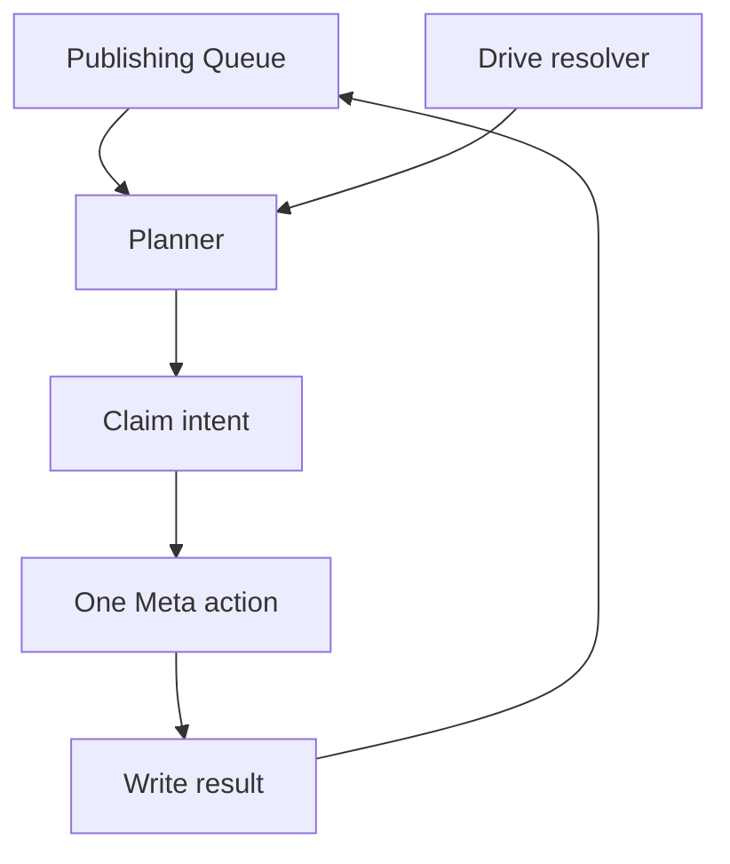
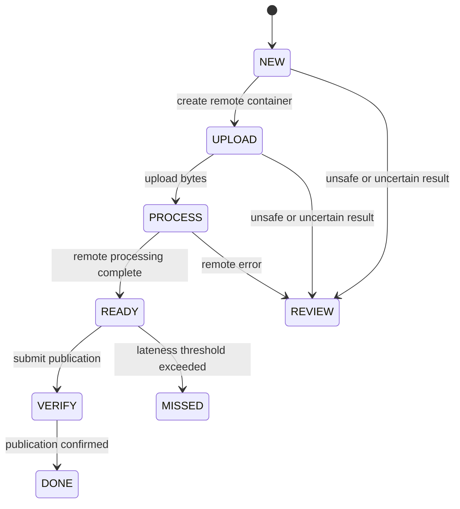

# Architecture and recovery model

## Components

The spreadsheet is both the editorial queue and the durable execution journal. The planner selects one safe action, records its intent, makes one remote request, and writes the result. A script lock prevents concurrent workers from claiming the same row.

## Platform independence

Every row has separate Facebook and Instagram status and state fields. A completed Facebook publication never needs to be reset merely because Instagram failed, and vice versa.

Static image workflows use the same safety principles but store staged Page photo IDs and Instagram child-container IDs in the state object.

## Intent-before-request boundary

Before every remote mutation the publisher:

1. re-reads the row
2. confirms its material fields and saved state did not change
3. writes `pending_action`, `pending_since`, and a unique `operation_id`
4. flushes the Sheet
5. sends exactly one remote mutation
6. confirms the same `operation_id` is still saved
7. writes the sanitized result

If a network failure makes the outcome uncertain, the publisher does not assume failure. Known publish containers are verified; requests that cannot be safely reconciled stop at `REVIEW`.

## Media signatures

A signature binds together:

- format
- caption
- ordered media paths
- Drive file IDs
- file sizes
- last-modified timestamps
- optional cover metadata
- scheduled publication value

Changing any of those fields after preparation begins stops the platform for review. This includes `publish_at`: Meta containers can expire, so rescheduling prepared media requires an operator to inspect and safely rebuild the affected platform state.

## Meta action sequences

| Format and platform | Action sequence |
| --- | --- |
| Facebook image/carousel | Stage each JPEG through `/{page-id}/photos` with `published=false`, then publish `/{page-id}/feed` with ordered `attached_media` |
| Instagram image | Use the staged Page photo's Meta CDN URL, create `/{ig-id}/media`, poll, then call `/{ig-id}/media_publish` |
| Instagram carousel | Create and poll child containers, create and poll the parent, then publish the parent |
| Facebook Reel | Start `/{page-id}/video_reels`, upload to the returned `rupload.facebook.com` URL, finish publication, then verify status |
| Instagram Reel | Create a resumable `/{ig-id}/media` container, upload bytes, poll, then publish |

Private Drive images are staged as unpublished Facebook Page photos so Instagram can fetch a Meta-hosted URL. This transfers the media to Meta and may leave unpublished media objects on the Page. Do not use this workflow for confidential media.

## Scheduling and limits

- Trigger cadence: approximately every five minutes
- Preparation window: 60 minutes before `publish_at`
- Late cutoff: 30 minutes after `publish_at`
- Maximum remote/local actions per run: 8
- Worker target runtime: 4 minutes
- Default video ceiling: 20 MiB
- Default image ceiling: 8 MiB
- Queue ceiling: 1,000 rows

These are conservative implementation defaults, not Meta's complete media limits.

## Trust boundary

The Page token is stored in Apps Script User Properties. Shared run coordination uses Script Properties. The setup page never reads the saved token back.

Every spreadsheet or bound-script editor must still be trusted: an editor can alter code that later executes as the trigger owner. This project is designed for a controlled single-business installation, not untrusted multi-tenant use.
